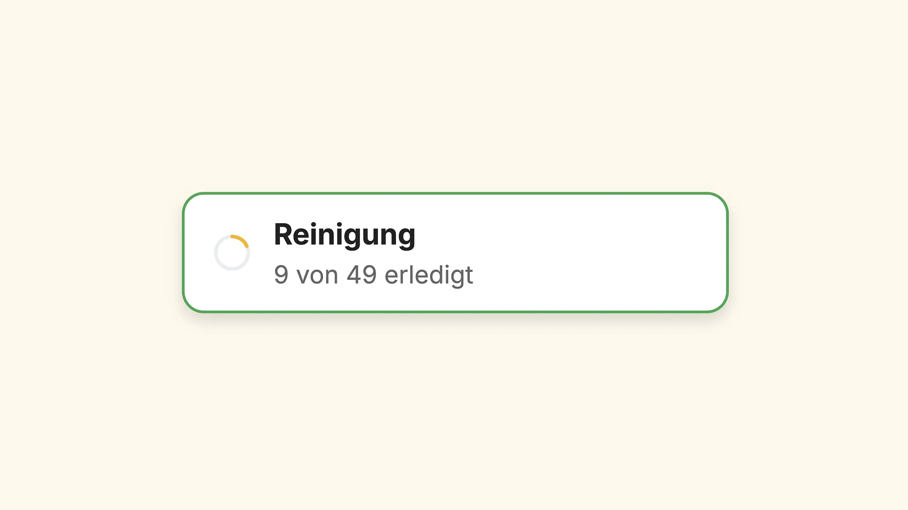
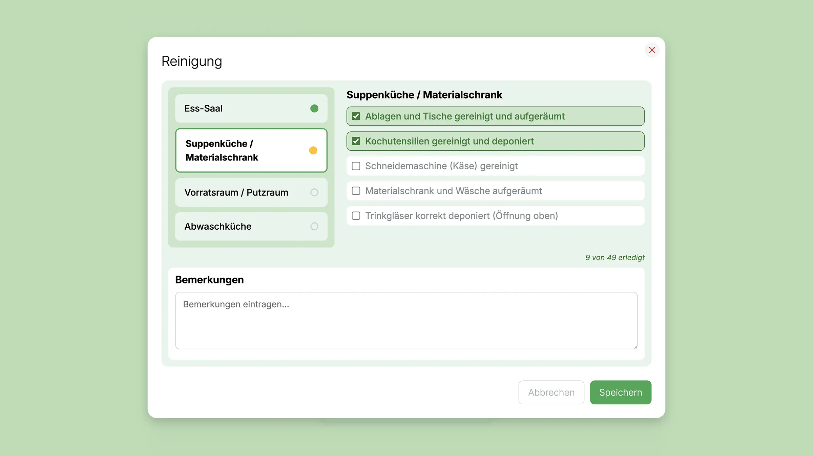

# UD Plugin: Reinigung

Digitales Werkzeug für Reinigungsaufgaben in Küchen, Räumen oder Arbeitsbereichen. Es zeigt den Fortschritt in Echtzeit und ermöglicht das einfache Abhaken direkt im Frontend.

## Funktionen

-   **Gutenberg-Block „UD Reinigung“**
    Anzeige und Steuerung von Reinigungsaufgaben direkt im Frontend – inkl. Statuswechsel (offen, in Arbeit, abgeschlossen).

-   **Echtzeit-Synchronisierung (Ably)**
    Änderungen werden sofort auf allen verbundenen Geräten aktualisiert.

-   **Frontend-Steuerung**

    -   Alle Reinigungsaufgaben werden direkt im Frontend bearbeitet – Aufgaben abhaken, Fortschritt speichern und Status in Echtzeit synchronisieren.
    -   Farbige Statusanzeige (z. B. Grün = erledigt, Rot = offen)
    -   Live-Aktualisierung ohne Reload

-   **Technische Merkmale**
    -   Build mit `@wordpress/scripts` (Webpack 5, SCSS → CSS, ESNext)
    -   Kompatibel mit Gutenberg ≥ WP 6.7
    -   FSE-kompatibel, Theme `ulrichdigital_block_theme`

## Screenshots

_Der Button zur Reinigung zeigt den aktuellen Fortschritt – erledigte und offene Aufgaben auf einen Blick._

_Erfassung und Kontrolle der Reinigungsaufgaben – Räume und Arbeitsschritte können direkt abgehakt und kommentiert werden._

## Voraussetzung:
Das Plugin UD Reservation[UD Reservation](https://github.com/ulrich-digital/ud-reservation) muss aktiv sein, da UD Reinigung dessen Echtzeit-Infrastruktur (Ably-Verbindung und gemeinsame Helper-Funktionen) nutzt.

## Installation

1. Repository in den Plugin-Ordner von WordPress kopieren:
   `/wp-content/plugins/ud-reinigung/`
2. Plugin im WordPress-Backend aktivieren.
3. Block **„UD Reinigung“** im Seiten- oder Beitragseditor hinzufügen.
4. Aufgaben und Verantwortlichkeiten im Backend definieren.
5. Änderungen erscheinen automatisch auf allen verbundenen Displays.

## Anforderungen

-   WordPress 6.7 oder neuer
-   PHP 8.0 oder höher
-   Aktives Theme `ulrichdigital_block_theme`
-   Optional Ably-API-Key für Echtzeit-Übertragung

## Autor

[ulrich.digital gmbh](https://ulrich.digital)

## Lizenz

Alle Rechte vorbehalten. Dieses Plugin ist urheberrechtlich geschützt und darf ohne ausdrückliche schriftliche Genehmigung der **ulrich.digital gmbh** weder kopiert, verbreitet, verändert noch weiterverwendet werden.
