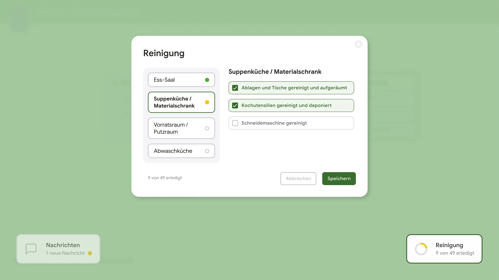

# UD Plugin: Reinigung

UD Reinigung bildet tagesbezogene Reinigungsaufgaben als strukturierten Arbeitsbereich in einer betrieblichen WordPress-Frontend-Anwendung ab. Mitarbeitende wählen einen Bereich, haken ausgeführte Arbeitsschritte ab und speichern den aktuellen Stand direkt im Frontend.

Ein Fortschrittsring in der gemeinsamen Navigation fasst erledigte und gesamte Aufgaben zusammen. Der vollständige Arbeitsbereich öffnet sich als Modalfenster und stellt die Aufgaben nach Räumen beziehungsweise Funktionsbereichen gegliedert bereit.

## Funktionen

- Tagesbezogene Reinigungsdatensätze in WordPress verwalten
- Aufgaben nach Arbeitsbereichen gliedern
- Einzelne Arbeitsschritte direkt im Frontend abhaken
- Aktuellen Stand über geschützte REST-Endpunkte laden und speichern
- Fortschritt aus erledigten und gesamten Aufgaben berechnen
- Fortschrittsring in der gemeinsamen Frontend-Navigation anzeigen
- Reinigungstag mit einem zugehörigen Suppentag verbinden
- Checklisten und Bemerkungen als strukturierte Metadaten speichern

## Frontend-Ansichten



Die Checkliste verbindet Bereiche, einzelne Arbeitsschritte und den Gesamtfortschritt in einer direkt bedienbaren Frontend-Oberfläche. Der Zugang zum Reinigungsbereich zeigt den aktuellen Stand bereits in der gemeinsamen Navigation.

## Datenstruktur

Das Plugin registriert den WordPress-Inhaltstyp `reinigung`. Checklisten und Bemerkungen werden als strukturierte Metadaten des jeweiligen Reinigungstages gespeichert.

Die zentral definierten Aufgaben dienen als gemeinsame Ausgangsstruktur. Beim Laden gleicht das Plugin gespeicherte Daten mit dieser Struktur ab. Ergänzte Aufgaben können dadurch in bestehende Reinigungsdatensätze übernommen werden.

## Frontend-Bedienung

Der Shortcode `[ud_reinigung_button]` erzeugt den Zugang zum Reinigungsbereich und das zugehörige Modalfenster. Das ausgewählte Datum bestimmt, welcher Reinigungsdatensatz geladen oder neu angelegt wird.

REST-Endpunkte verbinden die Frontend-Oberfläche mit den WordPress-Daten. Der Fortschritt wird nach dem Laden und Speichern aus den aktuellen Checklistenwerten berechnet.

## Einordnung in die Anwendung

UD Reinigung und [UD Notes](https://github.com/ulrich-digital/ud-notes) sind eigenständige Module derselben betrieblichen Frontend-Anwendung. Sie verwenden gemeinsame Interaktionsmuster wie Button-Bar, Statusanzeige und Modalfenster, tauschen untereinander jedoch keine Daten aus.

Die Zuordnung zu einem Suppentag setzt den in der zugehörigen Anwendung verwendeten Inhaltstyp `ud_suppentag` voraus. Abhängigkeiten und die gemeinsame Infrastruktur werden in einer geplanten Update-Runde technisch konsolidiert.

## Installation

1. Den Plugin-Ordner `ud-reinigung` nach `wp-content/plugins/` kopieren.
2. Die zugehörige Frontend-Anwendung und den Inhaltstyp für Suppentage bereitstellen.
3. UD Reinigung im WordPress-Backend aktivieren.
4. Den Shortcode `[ud_reinigung_button]` an der vorgesehenen Stelle der Frontend-Anwendung einfügen.

## Entwicklung

```bash
npm install
npm run start
```

Produktions-Build erstellen:

```bash
npm run build
```

## Einblicke in die Umsetzung

Der Beitrag gibt Einblick in die entwickelte Lösung und ihre Funktionsweise.

- **Mehr zur Lösung:** [Betriebliche Abläufe direkt im Frontend organisieren](https://ulrich.digital/betriebliche-ablaufe-direkt-im-frontend-organisieren/)

## Autor

[ulrich.digital gmbh](https://ulrich.digital)

## Lizenz

Dieses Projekt steht unter der [ulrich.digital Nutzungslizenz 1.0](LICENSE).

Die unveränderte Software darf in eigenen und kommerziellen Projekten eingesetzt werden. Auf jeder öffentlich erreichbaren Website oder Anwendung muss [ulrich.digital gmbh](https://ulrich.digital) im Impressum, in einem Credits-Bereich oder auf einer vergleichbaren Informationsseite genannt werden. Verkauf, eigenständige Weitergabe, Unterlizenzierung und Änderungen bedürfen der vorherigen schriftlichen Zustimmung von ulrich.digital gmbh.

Komponenten Dritter behalten ihre jeweiligen Lizenz- und Nutzungsbedingungen.
